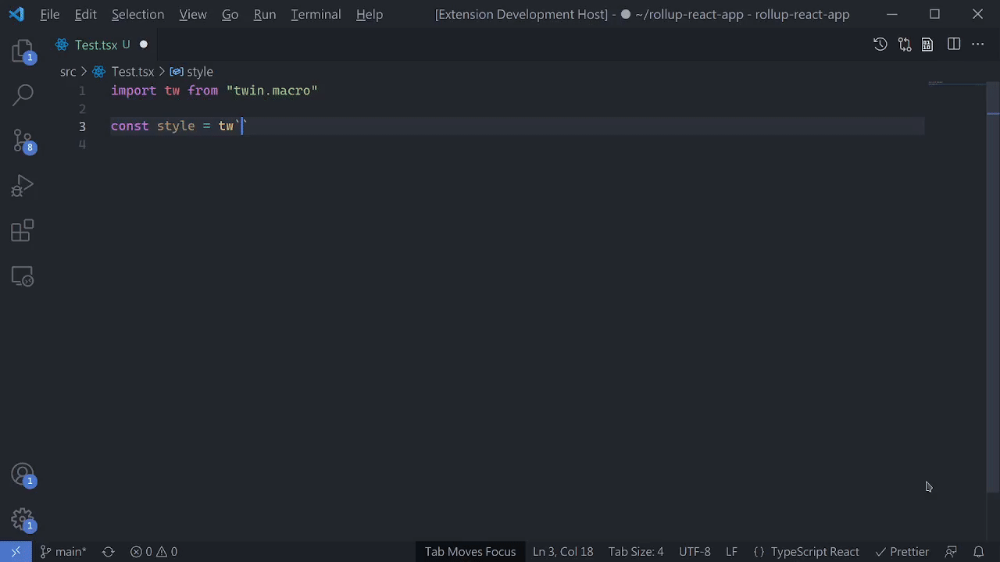

# Tailwind Twin IntelliSense

This is a VSCode Tailwind IntelliSense Extension which supports [twin.macro](https://github.com/ben-rogerson/twin.macro)

[Install via the Marketplace](https://marketplace.visualstudio.com/items?itemName=lightyen.tailwindcss-intellisense-twin)



## Features

- auto completion
- hover
- color decoration
- document references
- diagnostics

Support ONLY `*.tsx` and `*.jsx`

## Build

```sh
yarn && yarn build && yarn package
```

## VSCode Settings

### Recommended

```json5
{
  // none
}
```

### Defaults

```json5
{
  "tailwindcss.colorDecorators": "inherit", // inherit from "editor.colorDecorators"
  "tailwindcss.references": true,
  "tailwindcss.diagnostics": {
    "enabled": true,
    "emptyChecking": true,
  },
  "tailwindcss.preferVariantWithParentheses": false,
  "tailwindcss.fallbackDefaultConfig": true,
  "tailwindcss.enabled": true,
  "tailwindcss.jsxPropImportChecking": true,
  "tailwindcss.rootFontSize": 16,
  "tailwindcss.logLevel": "info",
  "tailwindcss.hoverColorHint": "none"
}
```

### Custom CompletionList Panel

```json5
// example
{
  "workbench.colorCustomizations": {
    "[One Dark Pro Darker]": {
      "editorHoverWidget.background": "#1f2229e8",
      "editorSuggestWidget.background": "#1f2229e8",
      "editor.wordHighlightBackground": "#0000",
      "editor.wordHighlightBorder": "#3f3f3f3d",
      "editor.wordHighlightStrongBorder": "#3f3f3f3d"
    }
  }
}
```

### Custom Semantic Colors [(docs)](https://code.visualstudio.com/api/language-extensions/syntax-highlight-guide)

```json5
{
  "editor.tokenColorCustomizations": {
    "[One Dark Pro Darker]": {
      "textMateRules": [
        {
          "scope": "support.constant.classname.twin",
          "settings": {
            "foreground": "#7ddb89"
          }
        },
        {
          "scope": "entity.other.inherited-class.variant.twin",
          "settings": {
            "foreground": "#c678dd"
          }
        },
        {
          "scope": "support.type.short-css.prop.twin",
          "settings": {
            "foreground": "#5dbeff"
          }
        },
        {
          "scope": "punctuation.section.embedded.short-css",
          "settings": {
            "foreground": "#5dbeff"
          }
        },
        {
          "scope": "support.type.arbitrary-style.prop.twin",
            "settings": {
              "foreground": "#8a88fc"
            }
        },
        {
          "scope": "support.type.arbitrary-style.endOpacity.twin",
            "settings": {
              "foreground": "#c05b5b6b"
            }
        },
        {
          "scope": "punctuation.section.embedded.arbitrary-style",
             "settings": {
               "foreground": "#8a88fc"
            }
        },
        {
          "scope": "entity.name.variable.css-value.twin",
          "settings": {
            "foreground": "#abb2bb"
          }
        }
      ]
    }
  }
}
```
